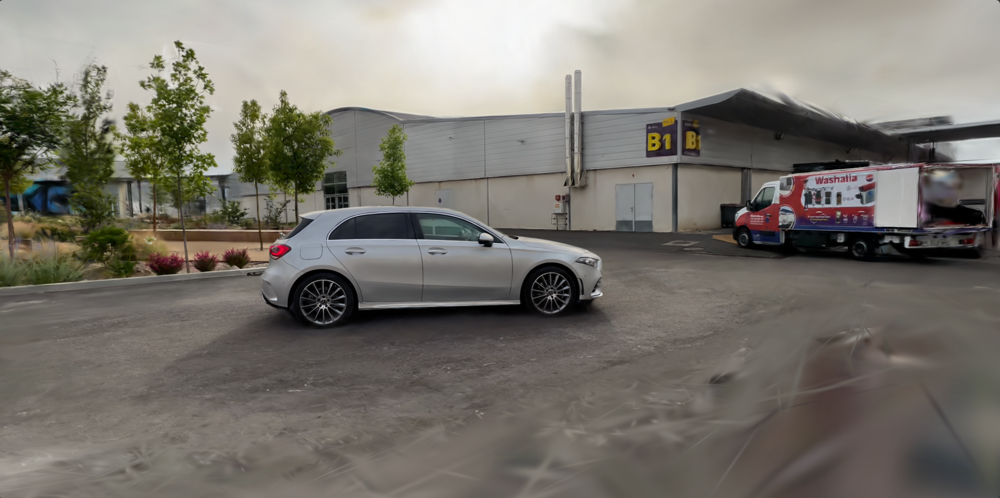
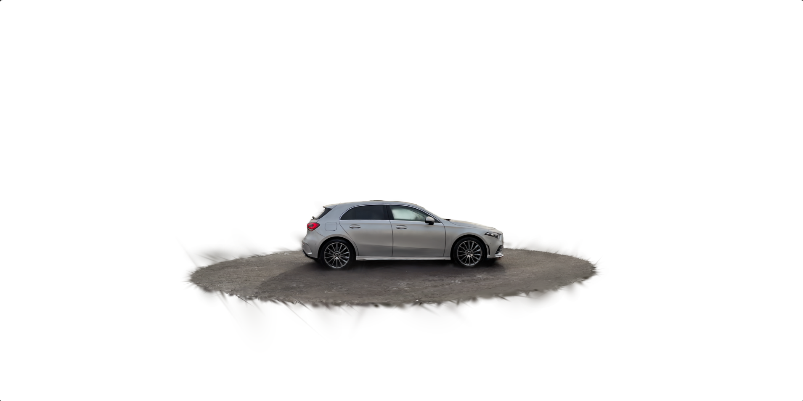
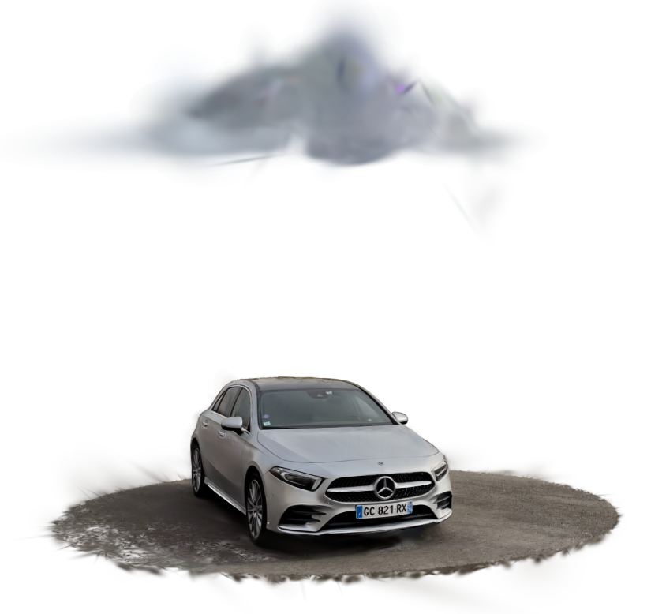
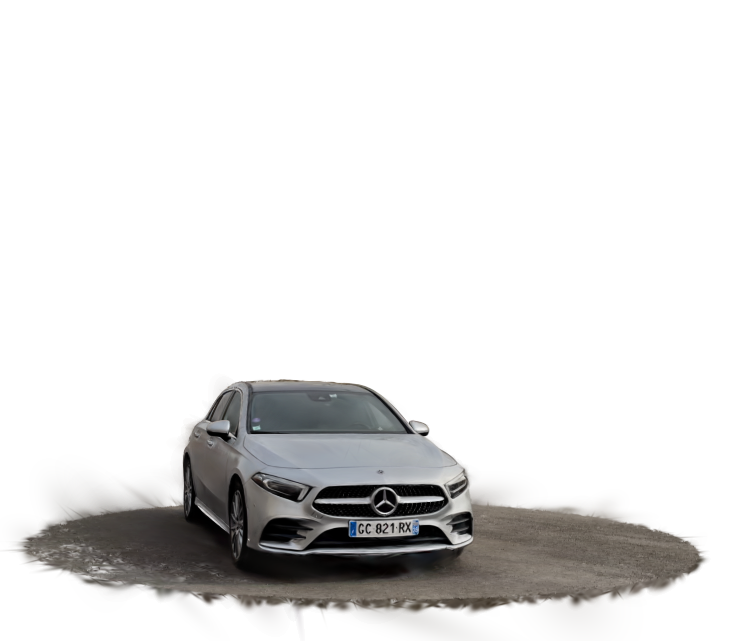

<h1 align="center">gStatLight</h1>

A command-line tool to **spotlight central objects** in 3D Gaussian Splatting (3DGS) reconstructions.  Given a walk-around video, gStatLight isolates the subject (e.g., a car) by keeping only Gaussians within a small radius of the scene’s origin.

<p align="center">
  
  
</p>

## 💾 Installation

### 1. Create & activate the Conda environment
```bash
conda create -n gsl python
conda activate gsl
```
### 2. Install dependencies

```bash
# Change directories to project root (gStatLight/):
cd <project-dir: gStatLight>

# Install SAM2, & CLIP
# This will also install a CUDA-enabled version of PyTorch (based on pip defaults)
pip install -r requirements.txt

# Install ffmpeg binary in the same env
conda install ffmpeg -c conda-forge

# Install the gStatLight package and its CLI entrypoints:
pip install .
```

### 3. Install SAM2 weights for semantic masks

```bash
cd ..  # Return to project root
mkdir -p models
wget https://dl.fbaipublicfiles.com/segment_anything_2/092824/sam2.1_hiera_large.pt -P models
```

## How it works

This tool processes 3D Gaussian Splatting (3DGS) scenes generated from walk-around video captures of vehicles, automatically isolating the vehicle from background elements through a two-stage culling pipeline.

### Stage 1: Statistical Culling
Assuming the vehicle is centered in the captured scene, the algorithm performs an initial culling pass based on Gaussian distribution statistics:

 * Radial culling (X/Y axes): Removes Gaussians beyond 0.2 standard deviations from center
 * Vertical culling (Z axis): Removes Gaussians beyond 0.6 standard deviations from center

The asymmetric threshold on the Z-axis accommodates vehicles with varying heights (trucks, SUVs, sedans, etc.) however this can noisy overhead elements.

<p align="center">
  
   <br>
 <em>After Stage 1</em>
</p>

### Stage 2: Mask-Based Refinement
After the initial statistical culling:

 * The scene is re-rendered from each original camera viewpoint
 * Binary masks are generated from each render
 * These masks identify remaining noise and outlier Gaussians

A final culling pass removes any Gaussians flagged by the mask-based analysis

This two-stage approach ensures robust vehicle isolation while preserving geometric detail, resulting in a clean 3DGS model ready for downstream applications.

<p align="center">
  
   <br>
 <em>After Stage 12</em>
</p>

## 📂 File Structure (Input Layout)

The tool requires the following structure:

```text
gCull/
├── data/
│   └── <experiment-name>/
│       ├── colmap/
│       ├── images/
│       ├── masks/                     ← created binary masks will be stored here
│       └──  transforms.json
|
└── outputs/
│   └── <experiment-name>/
│      └── splatfacto/
│          └── <model-name>/
│              └── config.yml          ← point to this config file for `statlight`
│              └── {...}_statlight.ply ← statlight output saved here
│
└── renders/
    └── <experiment-name>/             ← created renders are stored here
```

## 🚀 Execution

From your project root:

```
gsl statlight \
  --load-config <path/to/config.yml>
```

The final culled 3DGS model is saved alongside your ```config.yml``` as ```{experiment_name}_{model_name}_statlight.ply``` file.

## 🛠️ Acknowledgements

This work is built upon and heavily modifies the Nerfstudio/Splatfacto codebases.

